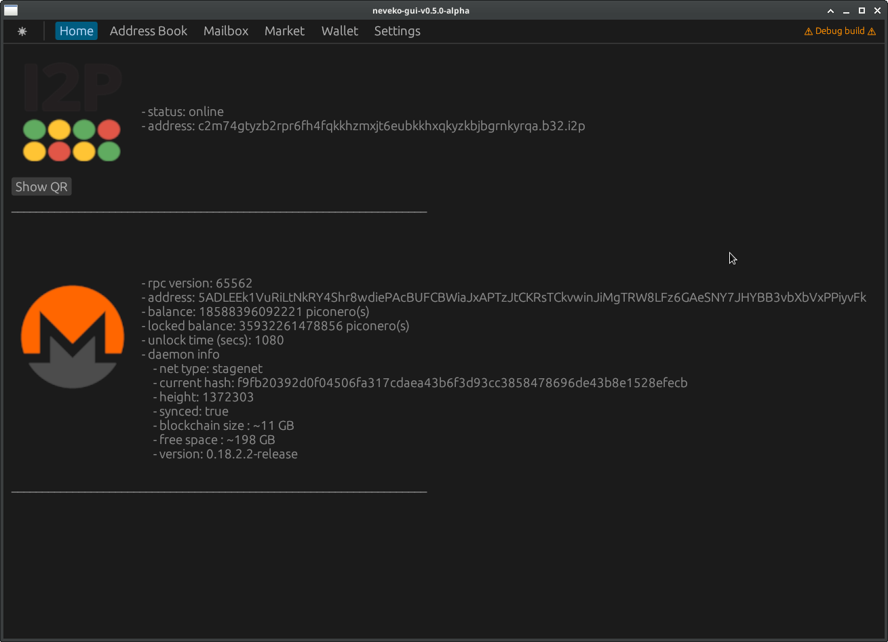

# NEVEKO

NEVidebla-EKOnomia (invisible economy)

[](https://github.com/creating2morrow/neveko/actions/workflows/rust.yml)
[](https://github.com/creating2morrow/neveko/actions/workflows/audit.yml)



### gpg and i2p made simple for E2EE marketplace, messaging and more

## About

* send messages over the invisible internet
* vanity base32 addresses (advanced)
* automated mandatory gpg key encryption
* self-hosted i2p marketplace
* xmr multisig / payment integration

## Dev

* stack - rust (egui, rocket), lmdb, i2p-zero, monero(rpc, daemon), gpg
* install dependencies
    * ubuntu example: `sudo apt update -y && sudo apt upgrade -y`
    * `sudo apt install -y libssl-dev build-essential libgpgme-dev`
* `git clone https://github.com/creating2morrow/neveko`
* `cd neveko && ./scripts/build_all_and_run.sh "-- -h"`
* Example to start neveko with remote stagenet node / i2p proxy remote for development:
    * `./scripts/build_all_and_run.sh "-- --monero-rpc-daemon http://xmr3kaacphwkk4z2gp35bdl47lrrnzimmyqj4oliauqrjzqecofa.b32.i2p:38081 --monero-location /path/to/monero-x86_64-linux-gnu-v0.18.2.2/ --i2p-proxy-host http://x.x.x.x:port --i2p-tunnels-json /path/to/manual-i2p/config/ --i2p-advanced --i2p-socks-proxy-host http://x.x.x.x:xxxx`
    * the `--monero-location` flag is needed even when using a remote node because
      neveko has its own monero-wallet-rpc instance
    * remote nodes are forced over the `--i2p-proxy-host`
* Recommended neveko-core startup with full node and i2p-zero locally running:
    * ` ./scripts/build_all_and_run.sh "-- --monero-blockchain-dir=/home/user/.bitmonero --monero-location /home/user/monero-x86_64-linux-gnu-v0.18.2.2 --i2p-zero-dir /home/user/i2p-zero-linux.v1.21/"`
    * monerod doesn't need to be running because neveko will start it and monero-wallet-rpc
    * gui will automatically detect monerod, rpc and i2p-zero if neveko core is started first
* gui built with rust [egui](https://docs.rs/egui/latest/egui/)

## Installation Mananger

* additional required software can be downloaded from the gui home or `Binaries` links below
* hashes are in core [lib.rs](./neveko-core/src/lib.rs)
* download i2p-zero, put the path in the connection manager or cli `--i2p-zero-dir` flag
* download monero, update connection manager or cli
  * `--monero-blockchain-dir`, where to put lmdb for monero (e.g. path/to/ssd)
  * `--monero-location`, path to monero download

## Contributing and Releasing

```bash
| branch |                 |tag and release|
  dev     -----------------|-------------------------------------------->
  v0.1.0  -----------tag v0.1.0 (delete branch)
  v0.2.0                   |-------------------------------------------->
  main    -------------------------------------------------------------->
```

* code on dev branch
* run `./scripts/fmtall.sh` before committing
* pull request to dev branch
* todo => `TODO(name): detailed work`
* docs on all `pub fn` and `pub struct`
* merge dev to vX.X.X
* merge vX.X.X to main
* tag release v.X.X.X every friday (if stable changes)
* release binaries from the `cargo-build-release` workflow with notes
* create next v.X.X+1.X branch and delete old release branch
* release bug fixes as appropriate to v.X.X.X+1 branch when ready

## Workflows

|name                | branch   | purpose                                     |
|--                  |--        |--                                           |
|cargo-build         | main,dev | ensure code compilation and build success   |
|cargo-audit         | main,dev | run security audit against RustSec database |
|cargo-build-release | `v0.*`   | publish production ready binaries           |

## API

* remote/programmatic access
* secured by wallet signing
* jwt and jwp
* see [curl.md](./docs/curl.md)

## Binaries

* neveko-auth - `internal` auth server
* neveko-contact - `internal` add contacts server
* neveko-gui - primary user interface
* neveko-market - `internal` marketplace admin server
* neveko-message - `internal` message tx/read etc. server
* neveko - `external` primary server for contact share, payment, market, message rx etc.
* [monerod](https://www.getmonero.org/downloads/#cli) - (not included) monero-wallet-rpc needs this
    * can be overriden with remote node
    * use the `--remote-node` flag
* [monero-wallet-rpc](https://www.getmonero.org/downloads/#cli) - (not included) interface for xmr wallet ops
* [i2p-zero](https://github.com/creating2morrow/i2p-zero/releases/tag/v1.21-neveko) - (not included) tunnel creation and http proxy

most of the complex logic stays in neveko-core, exported from [lib.rs](./neveko-core/src/lib.rs)

## Manual

[the manual](./docs/man.md)

## Donations

This is just a hobby project but if anything here is useful donations are much appreciated!
No need to send xmr, donating time is fine. Just test code if you can and open issues. Thanks!
