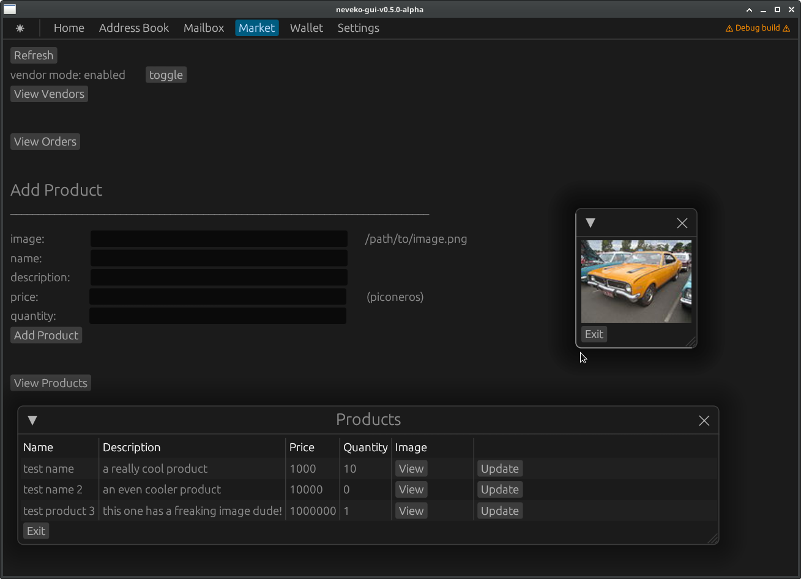

# neveko-market

## High-Level Order Lifecycle

* vendor adds a new product with description and price
* customer orders product
* vendor creates order, multisig wallet

|        | prepare | make | exchange |
|--      |--       |--    |--        |        
|vend    |         |      |          |          
|cust    |         |      |          |          
|med     |         |      |          |          

* customer creates multisig wallet and prepares while collecting participant info

|        | prepare | make | exchange |
|--      |--       |--    |--        |        
|vend    |     X   |      |          |          
|cust    |     X   |      |          |          
|med     |     x   |      |          |          

* customer makes and sends both prepare infos to mediator and vendor
* participants all make_info

|        | prepare | make | exchange |
|--      |--       |--    |--        |
|vend    |     X   |   x  |          |
|cust    |     X   |   x  |          |
|med     |     X   |   X  |          |

* customer calls to exchange multisig keys and collects outputs again

|        | prepare | make | exchange |
|--      |--       |--    |--        |
|vend    |     X   |   X  |          |
|cust    |     X   |   X  |      X   |
|med     |     X   |   X  |          |

* customer sends output to participants who then exchange multisig keys

|        | prepare | make | exchange |
|--      |--       |--    |--        |
|vend    |     X   |   X  |      X   |
|cust    |     X   |   X  |      X   |
|med     |     X   |   X  |      X   |
        
* customer funds wallet and exports info to vendor
* vendor imports multisig info
* vendor uploads delivery info and triggers and automate NASR (neveko auto-ship request) from customer
* customer requests shipment
* vendor drafts the multisig txset and sends to customer with tracking/delivery info
* order arrives, customer releases signed txset to vendor
* vendor signs and submits signed txset
* in case of dispute the mediator can sign multisig txset for customer refund
  or if the customer doesn't release payment after delivery

Reference: https://resilience365.com/monero-multisig-how-to/
